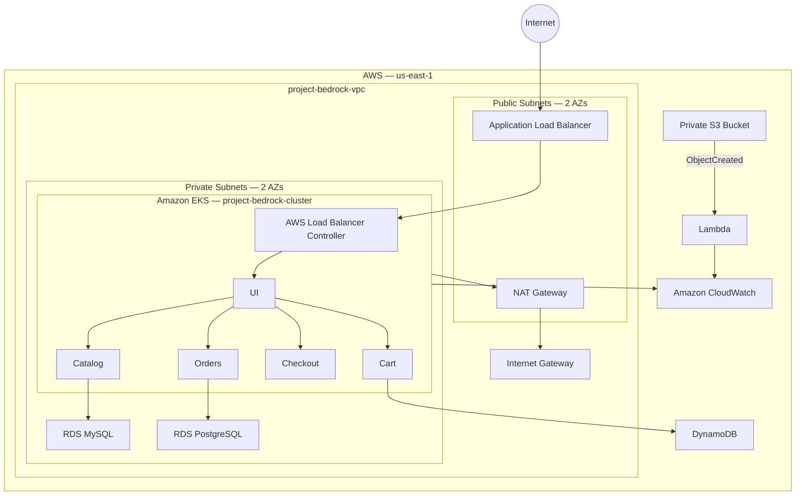

# Project Bedrock — InnovateMart EKS Deployment

Production deployment of the AWS Retail Store Sample Application on Amazon EKS using Terraform, Kubernetes/Helm, managed AWS data services, CloudWatch, S3/Lambda processing, and GitHub Actions CI/CD.

## 1. Project Overview

| Item | Value |
|---|---|
| Project | Project Bedrock |
| Company | InnovateMart Inc. |
| Assessment | Tinyuka Third Semester Exam — InnovateMart's Inaugural EKS Deployment |
| AWS Region | `us-east-1` |
| EKS Cluster | `project-bedrock-cluster` |
| Kubernetes Namespace | `retail-app` |
| VPC | `project-bedrock-vpc` |
| Project Tag | `Project=tinyuka-2025-capstone` |
| GitHub Repository | `RolxMeh/project-bedrock` |
| Default Branch | `main` |

The project provisions the infrastructure with Terraform and deploys the Retail Store Sample Application to Amazon EKS.

The completed environment includes:

- A VPC spanning two Availability Zones
- Public and private subnets
- A single NAT Gateway
- Amazon EKS with worker nodes in private subnets
- Retail Store Sample application services deployed with Helm
- Amazon RDS MySQL for Catalog persistence
- Amazon RDS PostgreSQL for Orders persistence
- DynamoDB for application persistence
- AWS Load Balancer Controller and an internet-facing Application Load Balancer
- CloudWatch control-plane and application/container logging
- EKS Access Entries for developer access
- Private S3 asset storage
- S3-triggered Lambda processing
- GitHub Actions CI/CD using GitHub OIDC
- Remote Terraform state stored in S3

---

## 2. Architecture

The deployed architecture is:



### Network

- VPC: `project-bedrock-vpc`
- Two public subnets across two Availability Zones
- Two private subnets across two Availability Zones
- Internet Gateway attached to the VPC
- One NAT Gateway for private-subnet outbound access
- EKS worker nodes deployed in private subnets
- Internet-facing ALB deployed through the AWS Load Balancer Controller
- RDS instances deployed in private subnets
- Database security groups restrict database access to the application network

---

## 3. Repository Structure

```text
project-bedrock/
├── .github/
│   └── workflows/
│       └── terraform.yml
│
├── helm/
│   ├── cart/
│   │   └── chart/
│   ├── catalog/
│   │   └── chart/
│   ├── checkout/
│   │   └── chart/
│   ├── orders/
│   │   └── chart/
│   └── ui/
│       └── chart/
│
├── lambda/
│   └── asset-processor/
│
├── terraform/
│   ├── bootstrap/
│   ├── modules/
│   │   ├── dynamodb/
│   │   ├── eks/
│   │   ├── rds/
│   │   ├── rds-mysql/
│   │   └── vpc/
│   ├── backend.tf
│   ├── providers.tf
│   ├── variables.tf
│   ├── outputs.tf
│   ├── eks.tf
│   ├── aws-load-balancer-controller.tf
│   ├── ui.tf
│   └── ...
│
├── grading.json
└── README.md
```

---

## 4. Terraform Infrastructure

Terraform is used to provision and manage the AWS infrastructure.

### Terraform State

The project uses an S3 remote backend instead of local Terraform state.

There are two Terraform layers:

1. `terraform/bootstrap` — provisions the remote-state infrastructure.
2. `terraform` — provisions the Project Bedrock infrastructure.

Bootstrap:

```bash
terraform -chdir=terraform/bootstrap init
terraform -chdir=terraform/bootstrap plan
terraform -chdir=terraform/bootstrap apply
```

Main infrastructure:

```bash
terraform -chdir=terraform init
terraform -chdir=terraform validate
terraform -chdir=terraform fmt -recursive
terraform -chdir=terraform plan
terraform -chdir=terraform apply
```

Terraform state locking is configured through the S3 backend.

---

## 5. AWS Infrastructure

The completed infrastructure includes:

### VPC

- VPC: `project-bedrock-vpc`
- Two Availability Zones
- Two public subnets
- Two private subnets
- Internet Gateway
- Single NAT Gateway

### EKS

- Cluster: `project-bedrock-cluster`
- Region: `us-east-1`
- Worker nodes run in private subnets
- Application namespace: `retail-app`

Configure `kubectl`:

```bash
aws eks update-kubeconfig \
  --region us-east-1 \
  --name project-bedrock-cluster
```

Verify:

```bash
kubectl get nodes
```

---

## 6. Application Deployment

The AWS Retail Store Sample Application is deployed into:

```text
retail-app
```

The deployed application components are:

- UI
- Catalog
- Cart
- Checkout
- Orders

The services are deployed with Helm charts stored in the repository.

Check Helm releases:

```bash
helm list -A
```

Check application pods:

```bash
kubectl get pods -n retail-app
```

The application was successfully brought up and tested through the public ALB endpoint.

---

## 7. Managed Data Layer

The application uses managed AWS data services instead of running the required databases inside the Kubernetes cluster.

### RDS MySQL

Amazon RDS MySQL is used for Catalog persistence.

The database is:

- A single RDS instance
- Deployed in a private subnet
- Protected by a database security group
- Configured with automated backups
- Not publicly exposed

### RDS PostgreSQL

Amazon RDS PostgreSQL is used for Orders persistence.

The database is:

- A single RDS instance
- Deployed in a private subnet
- Protected by a database security group
- Configured with automated backups
- Not publicly exposed

### DynamoDB

DynamoDB is provisioned with Terraform for application persistence.

The `orders` table was created in `us-east-1` and reached an `ACTIVE` state.

---

## 8. Database Connectivity

Database traffic remains private.

The application traffic pattern is:

```text
EKS application pods
        |
        v
Private EKS network
        |
        +------> RDS MySQL : 3306
        |
        +------> RDS PostgreSQL : 5432
```

Database security groups restrict inbound traffic to the application network.

Database credentials are not exposed through Terraform root outputs.

---

## 9. AWS Load Balancer Controller

The AWS Load Balancer Controller is installed in `kube-system`.

Verify:

```bash
helm list -n kube-system
```

Check the controller:

```bash
kubectl get pods -n kube-system | grep aws-load-balancer-controller
```

The controller uses the IAM permissions configured for the EKS cluster and provisions the Application Load Balancer for the Kubernetes Ingress.

---

## 10. Application Ingress

The UI is exposed through a Kubernetes Ingress using the AWS Load Balancer Controller.

Check the Ingress:

```bash
kubectl get ingress -n retail-app
```

The deployed ALB endpoint is:

```text
http://k8s-retailap-ui-6039ab69e6-461241174.us-east-1.elb.amazonaws.com
```

The application was accessed through this endpoint and the deployed UI was tested.

---

## 11. CloudWatch Observability

EKS control-plane logging is enabled and integrated with Amazon CloudWatch.

The enabled control-plane log types are:

- API
- Audit
- Authenticator
- Controller Manager
- Scheduler

The EKS control-plane log group follows the EKS naming convention:

```text
/aws/eks/project-bedrock-cluster/cluster
```

The Amazon CloudWatch Observability EKS add-on is also installed.

Verify:

```bash
aws eks describe-addon \
  --cluster-name project-bedrock-cluster \
  --addon-name amazon-cloudwatch-observability \
  --region us-east-1
```

List EKS add-ons:

```bash
aws eks list-addons \
  --cluster-name project-bedrock-cluster \
  --region us-east-1
```

Application/container logs are collected and available through CloudWatch.

The CloudWatch agents/DaemonSets were verified as running, and the cluster log group retention was configured to 7 days.

---

## 12. EKS Developer Access

Developer access is configured using EKS Access Entries rather than the legacy `aws-auth` ConfigMap.

The configured developer IAM user is:

```text
bedrock-dev-view
```

The access model provides:

- AWS Console read-only access
- Restricted S3 object upload access for the project assets bucket
- EKS view access
- Namespace-scoped Kubernetes access to `retail-app`

The developer can inspect workloads such as:

```bash
kubectl get pods -n retail-app
```

without receiving destructive Kubernetes permissions.

Credentials are not committed to the repository.

---

## 13. S3 Asset Storage

The project includes a private S3 bucket for application assets.

Bucket:

```text
bedrock-assets-alt-soe-tin-025-0051
```

The bucket is private and has S3 Block Public Access enabled.

Verify:

```bash
aws s3 ls s3://bedrock-assets-alt-soe-tin-025-0051
```

---

## 14. S3 → Lambda Processing

An event-driven S3/Lambda workflow was implemented.

Lambda function:

```text
bedrock-asset-processor
```

When an object is uploaded to the S3 bucket, an `ObjectCreated` event triggers the Lambda function.

The flow is:

```text
S3 Bucket
    |
    | ObjectCreated
    v
Lambda
bedrock-asset-processor
    |
    v
CloudWatch Logs
```

The Lambda function logs the received filename.

The S3 event trigger and Lambda logging were verified.

---

## 15. CI/CD

GitHub Actions is used for Terraform infrastructure CI/CD.

The workflows are:

```text
.github/workflows/terraform-plan.yml
.github/workflows/terraform-apply.yml
```

### Pull Request Workflow

Pull requests targeting `main` run:

```text
terraform fmt
terraform validate
terraform plan
```

The Terraform plan is posted to the pull request for review.

The pull-request workflow does not apply infrastructure changes.

### Main Branch Workflow

A merge to `main` triggers:

```text
terraform apply
```

The workflow applies the Terraform configuration to AWS.

### AWS Authentication

GitHub Actions authenticates to AWS using GitHub OIDC rather than hardcoded AWS access keys.

The OIDC-based authentication and CI/CD workflows were completed and verified successfully.

The completed deployment flow is:

```text
Developer
    |
    v
Git branch
    |
    v
Pull Request
    |
    v
GitHub Actions
    |
    +--> fmt
    +--> validate
    +--> terraform plan
    |
    v
Review
    |
    v
Merge to main
    |
    v
GitHub Actions
    |
    v
terraform apply
    |
    v
AWS Infrastructure
```

CI/CD is intentionally limited to Terraform infrastructure changes. Application images are not built or deployed by the GitHub Actions workflows.

---

## 16. Terraform Outputs

The root Terraform configuration exposes the non-sensitive values required by the assessment.

```bash
terraform -chdir=terraform output
```

The outputs include:

```text
assets_bucket_name
cluster_endpoint
cluster_name
region
vpc_id
```

Example:

```text
assets_bucket_name = "bedrock-assets-alt-soe-tin-025-0051"
cluster_name       = "project-bedrock-cluster"
region             = "us-east-1"
vpc_id              = "vpc-..."
```

Sensitive credentials and database passwords are not exposed through root Terraform outputs.

---

## 17. Grading Data

The project includes the required `grading.json` file generated from Terraform outputs.

Generate it from the Terraform root:

```bash
terraform -chdir=terraform output -json > grading.json
```

The file contains the required non-sensitive Terraform outputs.

---

## 18. Verification Commands

### Terraform

```bash
terraform -chdir=terraform fmt -check -recursive
terraform -chdir=terraform validate
terraform -chdir=terraform plan
```

### Terraform State

```bash
terraform -chdir=terraform state list
```

### EKS

```bash
kubectl get nodes
```

### Application

```bash
kubectl get pods -n retail-app
kubectl get svc -n retail-app
kubectl get ingress -n retail-app
```

### Helm

```bash
helm list -A
```

### EKS Add-ons

```bash
aws eks list-addons \
  --cluster-name project-bedrock-cluster \
  --region us-east-1
```

### RDS

```bash
aws rds describe-db-instances \
  --region us-east-1
```

### DynamoDB

```bash
aws dynamodb list-tables \
  --region us-east-1
```

### S3

```bash
aws s3 ls \
  s3://bedrock-assets-alt-soe-tin-025-0051
```

### Lambda

```bash
aws lambda get-function \
  --function-name bedrock-asset-processor \
  --region us-east-1
```

---

## 19. Security

The completed deployment follows the security controls implemented during the assessment:

- EKS worker nodes are deployed in private subnets.
- RDS databases are not publicly exposed.
- Database security groups restrict inbound traffic.
- S3 Block Public Access is enabled on the assets bucket.
- EKS developer access uses EKS Access Entries.
- Kubernetes developer permissions are view-oriented and namespace-scoped.
- GitHub Actions uses OIDC for AWS authentication.
- AWS access keys are not hardcoded in CI/CD workflows.
- Sensitive database credentials are not exposed through Terraform root outputs.
- Assessment credentials are not committed to Git.

---

## 20. Current Deployment Details

### Project

```text
Project Bedrock
```

### Region

```text
us-east-1
```

### VPC

```text
project-bedrock-vpc
```

### EKS Cluster

```text
project-bedrock-cluster
```

### Namespace

```text
retail-app
```

### S3 Assets Bucket

```text
bedrock-assets-alt-soe-tin-025-0051
```

### Lambda

```text
bedrock-asset-processor
```

### Application URL

```text
http://k8s-retailap-ui-6039ab69e6-461241174.us-east-1.elb.amazonaws.com
```

### GitHub Repository

```text
https://github.com/RolxMeh/project-bedrock
```

---

## 21. Assessment Verification Checklist

### Infrastructure

- [x] AWS region is `us-east-1`
- [x] EKS cluster is `project-bedrock-cluster`
- [x] VPC is `project-bedrock-vpc`
- [x] Project tag is `Project=tinyuka-2025-capstone`
- [x] VPC spans two Availability Zones
- [x] Public and private subnets are deployed
- [x] Single NAT Gateway is deployed
- [x] EKS is deployed
- [x] Remote Terraform state is configured
- [x] Terraform state locking is configured

### Application

- [x] Retail Store Sample Application is deployed
- [x] Application namespace is `retail-app`
- [x] UI is deployed
- [x] Catalog is deployed
- [x] Cart is deployed
- [x] Checkout is deployed
- [x] Orders is deployed
- [x] Helm is used for application deployment
- [x] AWS Load Balancer Controller is deployed
- [x] Application is exposed through an internet-facing ALB
- [x] Application was accessed and tested through the ALB URL

### Managed Data Layer

- [x] RDS MySQL is deployed for Catalog persistence
- [x] RDS PostgreSQL is deployed for Orders persistence
- [x] DynamoDB is deployed
- [x] RDS instances are private
- [x] Database security groups restrict inbound access
- [x] Automated RDS backups are configured

### Observability

- [x] EKS control-plane logging is enabled
- [x] API logging is enabled
- [x] Audit logging is enabled
- [x] Authenticator logging is enabled
- [x] Controller Manager logging is enabled
- [x] Scheduler logging is enabled
- [x] CloudWatch Observability add-on is installed
- [x] CloudWatch agents/DaemonSets are running
- [x] Application/container logs are available in CloudWatch
- [x] Cluster log retention is configured to 1 day

### Developer Access

- [x] `bedrock-dev-view` IAM user is configured
- [x] Read-only AWS access is configured
- [x] S3 access is restricted to the project assets bucket
- [x] EKS Access Entry is used
- [x] Kubernetes access is namespace-scoped

### Serverless

- [x] Private S3 assets bucket is deployed
- [x] S3 Block Public Access is enabled
- [x] Lambda `bedrock-asset-processor` is deployed
- [x] S3 event notification is configured
- [x] S3 → Lambda processing was verified
- [x] Lambda logging is available through CloudWatch

### CI/CD

- [x] GitHub Actions Terraform plan workflow is configured
- [x] Pull requests trigger Terraform plan
- [x] Terraform plan is available for pull-request review
- [x] Main branch triggers Terraform apply
- [x] GitHub OIDC authentication is configured
- [x] CI/CD workflows completed successfully
- [x] AWS credentials are not hardcoded in the workflows

---

## 22. Final Submission Information

### Project

```text
Project Bedrock
```

### Repository

```text
https://github.com/RolxMeh/project-bedrock
```

### Region

```text
us-east-1
```

### EKS Cluster

```text
project-bedrock-cluster
```

### Namespace

```text
retail-app
```

### Application URL

```text
http://k8s-retailap-ui-6039ab69e6-461241174.us-east-1.elb.amazonaws.com
```

### S3 Assets Bucket

```text
bedrock-assets-alt-soe-tin-025-0051
```

### Lambda

```text
bedrock-asset-processor
```

---

## Conclusion

Project Bedrock is a Terraform-managed Amazon EKS deployment of the Retail Store Sample Application.

The completed environment includes:

- Multi-AZ VPC networking
- Private EKS worker nodes
- Managed RDS MySQL and PostgreSQL
- DynamoDB
- AWS Load Balancer Controller
- Internet-facing Application Load Balancer
- CloudWatch observability
- EKS Access Entry-based developer access
- Private S3 asset storage
- S3-triggered Lambda processing
- Remote Terraform state
- GitHub Actions CI/CD with GitHub OIDC
- Automated RDS backups
- Helm-based application deployment

The application was successfully deployed, exposed through the ALB, and tested, while the infrastructure and CI/CD workflows were verified during the assessment.
